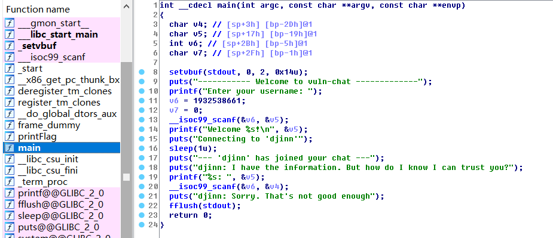

# WEB

---

## High Source(25)

> This guy is getting wayyy too full of himself. He's called himself a master programmer, and he believes he has written a secure login function. Knock him off his high source.

F12查看源代码，看到login.js

```
var password = "I4m4M4st3rC0d3rH4x0rsB3w43";
```

用此密码登录获得flag

## Cookie Duty(50)

> You have been summoned for Jury Duty. Try out the new web form with a state-of-the-art authentication system.

最先进的认证系统？使用JuryDuty登录跳转显示

> You are signed up for Jury Duty and aren't an admin.

由于题名为Cookie Duty，查看cookie，发现有项not_admin=1，改为0得到flag

## Git Gud(100)

> Jimmy has begun learning about Version Control Systems and decided it was a good time to put it into use for his person website. Show him how to Git Gud.

一开始不知道.git/文件夹泄露，浏览各网页发现有个博客更新记录，然后发现http头有cache，以为是要获取过去的E-Tag，从而获取过去缓存的数据。在尝试很久后发现，http的缓存只会保存最新的，而且client也只能获取最新数据。

后来查到.git/文件夹泄露，使用命令扒下整个文件夹。

```
wget -r -p -np http://gitgud.tuctf.com/.git/
```

拖进git gui客户端，即可看到过去版本，得到flag。

## Cookie Harrelson(200)

> Woody Harrelson has decided to take up web dev after learning about Cookies. Show him that he should go back to killing zombies.

又是一道cookie题，尝试将cookie改成harrelson等，发现服务器都会将其设为[Y2F0IGluZGV4LnR4dCAj+我设置的cookie] ，base64解码发现此为linux命令

```shell
cat index.txt #
```

猜测网站逻辑为，提取cookie和固定头连接并base64解码后调用系统运行，并将结果返回。由于行末有#过滤后面的命令，于是空行后输入所需命令。

```shell

cat *
```

```
base64> CmNhdCAq
```

将base64编码过后的值设为cookie，即可得flag


# Pwn

---

## vuln chat(50)

> One of our informants goes by the handle djinn. He found some information while working undercover inside an organized crime ring. Although we've had trouble retrieving this information from him. He left us this chat client to talk with him. Let's see if he trusts you...

```
> checksec vuln-chat
	Arch:     i386-32-little
    RELRO:    No RELRO
    Stack:    No canary found
    NX:       NX enabled
    PIE:      No PIE (0x8048000)
```



程序有两次输入，同时有个printFlag函数，所以应该是栈溢出。尝试覆写ret值，但是没成功覆写到位置，发现输入限制了长度（即v6值"%30s")，于是第一次覆写v6，第二次再覆写ret值，得到flag。